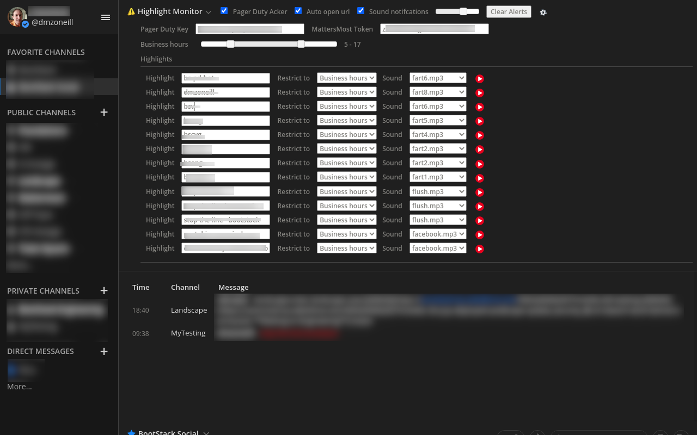

# MattersHighLight

Get started:

```
git clone https://github.com/dmzoneill/MattersHighLight.git
cd MattersHighLight
mkdir userdir
```

<br>

Modify manifest.json (to provide your own sounds) if you wish:

```
vim manifest.json
```

<br>

Prep the icon, seperate binary and copy the desktop file into place

```
sudo cp /opt/google/chrome/google-chrome /opt/google/chrome/mattersmost
sudo inkscape -z -w 128 -h 128 /opt/Mattermost/icon.svg -e /opt/Mattermost/mm.png
```

<br>

Creating a seperate window with matters most icon

```
cat HighMonMattersMost.desktop 
[Desktop Entry]
Encoding=UTF-8
Version=1.0
Type=Application
Terminal=false
Exec=/opt/google/chrome/mattersmost --autoplay-policy=no-user-gesture-required --disable-features=PreloadMediaEngagementData,AutoplayIgnoreWebAudio,MediaEngagementBypassAutoplayPolicies --new-window --app=https://chat.yourhost.com --user-data-dir="/home/dmzoneill/src/bsMMhighmon/userdir" --class="Chr2"
Name=Highmon MattersMost
Icon=/opt/Mattermost/mm.png
StartupWMClass=Chr2
StartupNotify=true
Categories=Network;WebBrowser;
```

<br>

Copy desktop file in place

```
cp HighMonMattersMost.desktop  ~/.local/share/applications/
```

<br>

To install the extension, the first time you need to run it without "--app=https://chat.yourhost.com"
go to:

```
extensions > load plugin > select to plugin folder
```

<br>

Visit your matters most website:

```
click settings, provide MM auth token and pagerduty key
```

<br>


<br>

